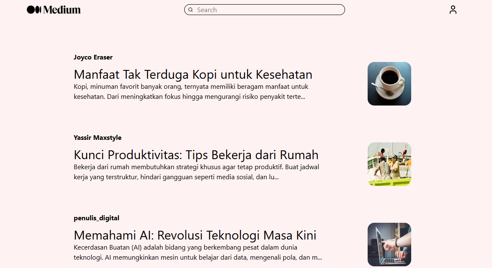
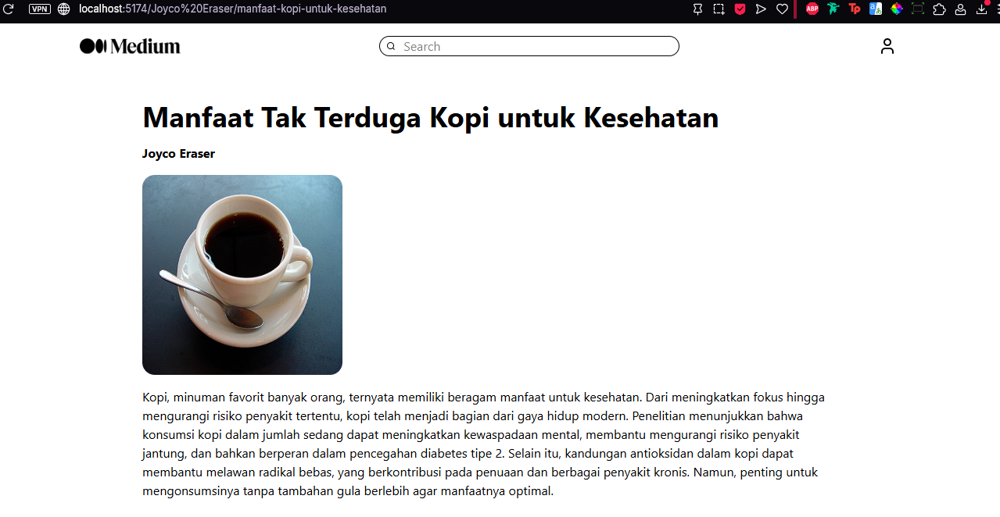
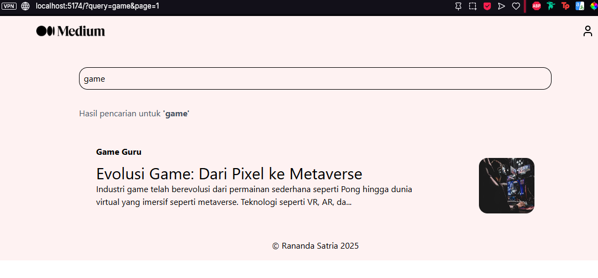
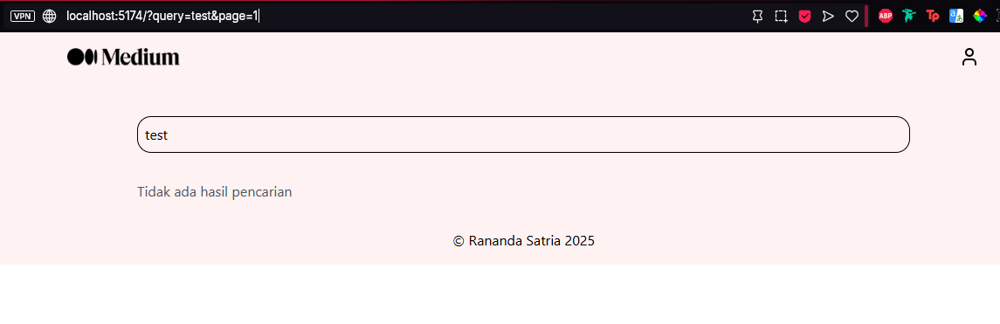

# 📰 Article Viewer – ReactJS

A sleek and modern web app inspired by **Medium**, built with **React** and **React Router**. Users can browse a curated list of articles and navigate to detailed views using intuitive URL routes like `/username/slug`.

Crafted for a smooth, focused reading experience with fast routing and a minimalist UI.

---

## 🔍 Preview

| Home | Article Detail | Search Found | Search Not Found |
|------|----------------|--------------|------------------|
|  |  |  |  |

---

## 🚀 Getting Started

### 🔧 Manual Installation (Beginner Friendly)

#### 1. Prerequisites

Make sure you have the following installed:

- [Node.js](https://nodejs.org/) (v16 or later)
- [Git](https://git-scm.com/)
- Terminal or code editor (e.g., VS Code)

#### 2. Clone the repository

```bash
git clone https://github.com/ranandasatria/fgo24-react-medium.git
cd fgo24-react-medium
```

#### 3. Install dependencies

```bash
npm install
```

> 💡 Tip: You can use `npm ci` for a clean install using `package-lock.json`.

#### 4. Start the development server

```bash
npm run dev
```

The app will be available at:

```
http://localhost:8080
```

#### 5. (Optional) Build for production

```bash
npm run build
```

To preview the production build locally:

```bash
npm run preview
```

---

### 🐳 Docker Setup (Alternative)

#### 1. Clone the project

```bash
git clone https://github.com/ranandasatria/fgo24-react-medium.git
cd fgo24-react-medium
```

#### 2. Build Docker image

```bash
docker build . -t ubuntu:medium
```

#### 3. Run the container

```bash
docker run -d -p 8080:80 ubuntu:medium
```

#### 4. Access the app in your browser

```
http://localhost:8080
```

> 🛑 To stop the container:
> ```bash
> docker ps
> docker stop <container_id>
> ```

---

## ⚙️ Dependencies

This project uses:

- [React](https://reactjs.org/) — UI library
- [React Router](https://reactrouter.com/) — For client-side routing
- [Vite](https://vitejs.dev/) — For fast development and builds
- [Node.js](https://nodejs.org/) — JavaScript runtime

---

## 🤝 How to Contribute

Want to improve or extend the project?

1. Fork the repository  
2. Create a feature branch (`git checkout -b feature-name`)  
3. Commit your changes  
4. Push to your fork  
5. Open a Pull Request (PR)

Your PR will be reviewed and merged if accepted.

---

## 📄 License

This project is licensed under the **MIT License**.  

---

## ©️ Copyright

&copy; 2025 Kodacademy
