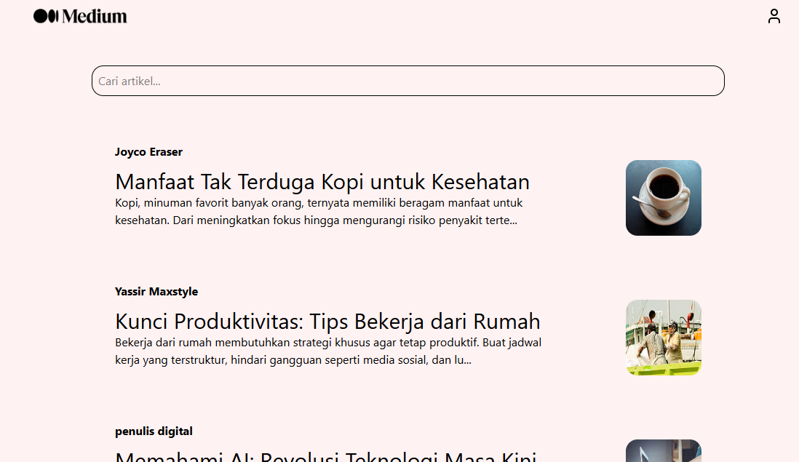
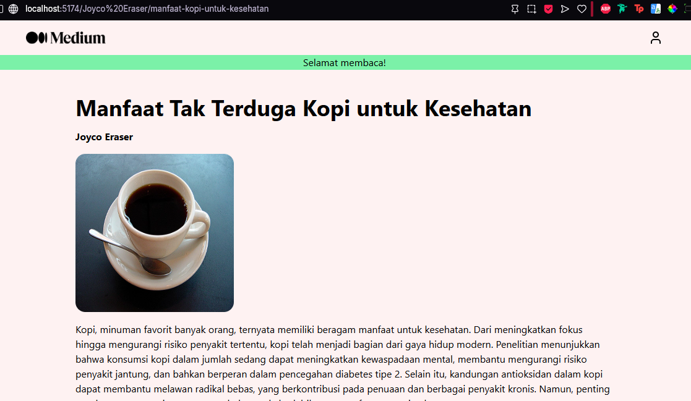

# Article Viewer - ReactJS

Article Viewer is a sleek, React-powered web app inspired by Medium, designed to showcase articles with a seamless browsing experience. Built with React Router, it lets users explore a curated list of articles and dive into details through intuitive /username/slug navigation.

## Preview




## Getting Started
1. Clone this project:
```
git clone https://github.com/ranandasatria/fgo24-react-medium
```

2. Install the depedencies:
```
npm install
```

3. Run the project:
```
npm run dev
```

4. The project will be runnning at:
``` 
http://localhost:8080
```

## Depedencies

This project uses Node.js. Make sure you have Node.js installed on your machine.

- vite: to simulate an HTTP server in a local environment.

## How to contribute

Please open a Pull Request (PR) to contribute to this project.
Your PR will be reviewed and merged if necessary.

## License

This project following MIT License.

## Copyright
&copy; 2025 Kodacademy

